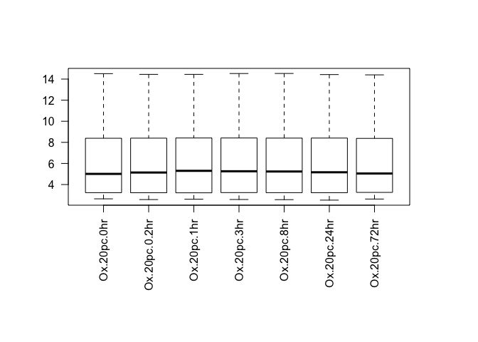
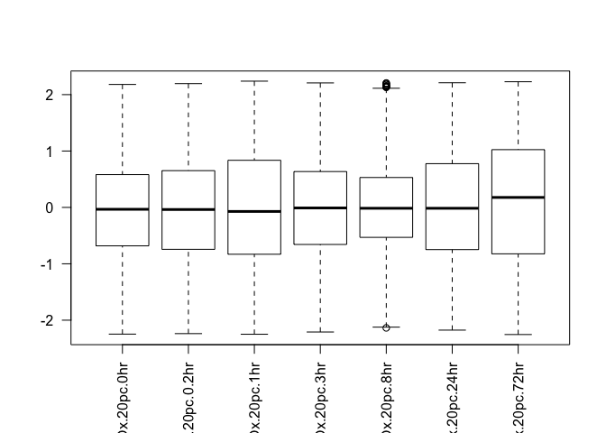

Foundations of R programming I
================
Shamit Soneji
12/10/2018

Why use R?
----------

R is a programming environment with a focus on mathematics and statistics, but can be used for a variety of applications given the flexibility of the language. R is also free and available for all operating systems. Given the richness of the language and no cost to use it, bioinformaticians have adopted R as the platform for which which to develop packages to solve bioinformatics problems.

Getting R
---------

Point your browser to <http://cran.r-project.org/> to download and install the latest version of R. For these tutorials we are also going o use [RStudio](http://www.rstudio.com/) which is an advanced environment for R which includes a window for an editor, console, and plotting window. You will see what this means later.

With respect to bioinformatics, the central repository for bioinformatics tools is [Bioconductor](http://www.bioconductor.org) where packages are deposited for easy installation.

Before we go on to these, we need to get to grips with the basics of the R language first.

R- The basics
-------------

### 1- Vectors

The R language is relatively intuative. For example, making a string of numbers from 1 to 10:

``` r
x <- c(1,2,3,4,5,6,7,8,9,10)
```

The "c" in the code above means "combine", therefore all the comma separated numbers between the parentheses are put together to create a `vector`.

To view the contents of the object you have just created, just type "x" and hit return:

``` r
x
```

    ##  [1]  1  2  3  4  5  6  7  8  9 10

There is a much simpler way to create the same type of object:

``` r
x <- 1:10
x
```

    ##  [1]  1  2  3  4  5  6  7  8  9 10

Much better. Using a comma will always do increments of 1, but is also bidirectional:

``` r
y <- 5:-5
y
```

    ##  [1]  5  4  3  2  1  0 -1 -2 -3 -4 -5

Another way of ceating a sequence of numbers is to use the `seq` function. To learn how this function works, issue the command `help(seq)`. In R you can get a manual for any function using the `help()` command. To generate a vector of numbers from 1 to 100 in steps of 10 we need:

``` r
a <- seq(0,100,by=10)
a
```

    ##  [1]   0  10  20  30  40  50  60  70  80  90 100

***Exercise:*** Generate a vector called 'b' ranging from 3 to 987 where the length of the vector is 53 entries long. Done? Check the length of the vector you have just made by issuing `length(b)`.

Now that we can make vectors we can start playing with them. for example:

``` r
c <- 1:50
d <- 1/c
```

Lets plot the numbers contained in the object we called `d`:

``` r
plot(d)
```

 Note the way the axes are labelled in the plot function.

***Exercise:*** Call `help(plot)` and read about the other options available. Produce the same plot as above, but this time as a line plot which is coloured red. Also, label the axes and give the plot a title.

We can also do basic calculations on vectors:

``` r
mean(d) # calculate the mean of the vector
```

    ## [1] 0.08998411

``` r
sd(d) # the standard deviation
```

    ## [1] 0.1578087

### 2- Matricies

Matricies are the most common data format bioinformaticians work with (microarray data for example). Lets make one:

``` r
m <- matrix(0,ncol=5,nrow=10)
m
```

    ##       [,1] [,2] [,3] [,4] [,5]
    ##  [1,]    0    0    0    0    0
    ##  [2,]    0    0    0    0    0
    ##  [3,]    0    0    0    0    0
    ##  [4,]    0    0    0    0    0
    ##  [5,]    0    0    0    0    0
    ##  [6,]    0    0    0    0    0
    ##  [7,]    0    0    0    0    0
    ##  [8,]    0    0    0    0    0
    ##  [9,]    0    0    0    0    0
    ## [10,]    0    0    0    0    0

This will create a matrix filled with zeros. To transpose the matrix we use `t()` (this will be important later)

``` r
tposed.m <- t(m)
tposed.m
```

    ##      [,1] [,2] [,3] [,4] [,5] [,6] [,7] [,8] [,9] [,10]
    ## [1,]    0    0    0    0    0    0    0    0    0     0
    ## [2,]    0    0    0    0    0    0    0    0    0     0
    ## [3,]    0    0    0    0    0    0    0    0    0     0
    ## [4,]    0    0    0    0    0    0    0    0    0     0
    ## [5,]    0    0    0    0    0    0    0    0    0     0

Lets make a matrix (and a vector) containing numbers so we can look at subsetting:

``` r
v <- 1:10
m <- t(matrix(1:50,ncol=10,nrow=5))
m
```

    ##       [,1] [,2] [,3] [,4] [,5]
    ##  [1,]    1    2    3    4    5
    ##  [2,]    6    7    8    9   10
    ##  [3,]   11   12   13   14   15
    ##  [4,]   16   17   18   19   20
    ##  [5,]   21   22   23   24   25
    ##  [6,]   26   27   28   29   30
    ##  [7,]   31   32   33   34   35
    ##  [8,]   36   37   38   39   40
    ##  [9,]   41   42   43   44   45
    ## [10,]   46   47   48   49   50

We can access individual elements using square brackets `[]`. Here are some examples:

``` r
v[c(7,1,5)] #access elements 7 1 and 5 of the vector
```

    ## [1] 7 1 5

``` r
m[1,] # access the first row of the matrix
```

    ## [1] 1 2 3 4 5

``` r
m[,3] # the 3rd column
```

    ##  [1]  3  8 13 18 23 28 33 38 43 48

``` r
m[8,2] # the value in the 8th row and 2nd column
```

    ## [1] 37

``` r
m[3:7,4] # the 3rd to 7th row of the 4th columnß
```

    ## [1] 14 19 24 29 34

We often have the need to collect vectors and assemble them into matricies. This can be done using the `rbind` (row) and `cbind` (column) function:

``` r
v1 <- 1:10
v2 <- 101:110
rbound.mat <-rbind(v1,v2)
cbound.mat <- cbind(v1,v2)
rbound.mat
```

    ##    [,1] [,2] [,3] [,4] [,5] [,6] [,7] [,8] [,9] [,10]
    ## v1    1    2    3    4    5    6    7    8    9    10
    ## v2  101  102  103  104  105  106  107  108  109   110

``` r
cbound.mat
```

    ##       v1  v2
    ##  [1,]  1 101
    ##  [2,]  2 102
    ##  [3,]  3 103
    ##  [4,]  4 104
    ##  [5,]  5 105
    ##  [6,]  6 106
    ##  [7,]  7 107
    ##  [8,]  8 108
    ##  [9,]  9 109
    ## [10,] 10 110

### 3- Lists

Lists are a class of container which allow multiple objects to be stored in a single variable. For example:

``` r
alpha <- LETTERS[1:8]
mat <- matrix(rnorm(40),nrow=8)
listex1  <- list(char=alpha,nums=mat)
```

Each element can now be accessed via `$`:

``` r
listex1$char
```

    ## [1] "A" "B" "C" "D" "E" "F" "G" "H"

``` r
listex1$nums
```

    ##            [,1]        [,2]        [,3]        [,4]        [,5]
    ## [1,] -0.7077838  0.59218380  0.14112945  1.53181918  0.39354272
    ## [2,] -0.2795684  0.43165367  0.40928033 -0.09216268  2.40373756
    ## [3,] -0.4664887  1.18777180 -1.05414865 -0.46526350  1.54306885
    ## [4,] -0.4652063  0.96243726 -1.03891519 -0.36548542 -0.08898449
    ## [5,]  0.1796974  0.62541354  1.23312580  0.91655493  1.26404728
    ## [6,]  1.2365749  0.01987371  1.02335777 -1.27464526  0.52628107
    ## [7,] -0.8052876 -0.20344822  0.05462278 -2.07448447  1.16689108
    ## [8,]  0.1068559  0.84296458 -0.40922802  0.26864080 -0.07623064

``` r
listex1$nums[1,] # the matrix within the list issubsetted as before
```

    ## [1] -0.7077838  0.5921838  0.1411295  1.5318192  0.3935427

Another way of doing the above is:

``` r
listex1[[1]] # note the double square brackets
```

    ## [1] "A" "B" "C" "D" "E" "F" "G" "H"

``` r
listex1[[2]]
```

    ##            [,1]        [,2]        [,3]        [,4]        [,5]
    ## [1,] -0.7077838  0.59218380  0.14112945  1.53181918  0.39354272
    ## [2,] -0.2795684  0.43165367  0.40928033 -0.09216268  2.40373756
    ## [3,] -0.4664887  1.18777180 -1.05414865 -0.46526350  1.54306885
    ## [4,] -0.4652063  0.96243726 -1.03891519 -0.36548542 -0.08898449
    ## [5,]  0.1796974  0.62541354  1.23312580  0.91655493  1.26404728
    ## [6,]  1.2365749  0.01987371  1.02335777 -1.27464526  0.52628107
    ## [7,] -0.8052876 -0.20344822  0.05462278 -2.07448447  1.16689108
    ## [8,]  0.1068559  0.84296458 -0.40922802  0.26864080 -0.07623064

``` r
listex1[[2]][1,]
```

    ## [1] -0.7077838  0.5921838  0.1411295  1.5318192  0.3935427

4- Reading and writing files
============================

To analyse data in R, you have to get the data into R first (this helps a lot). R has some useful functions to do this, so now we can take our first look at some microarray data. Download this file (<http://bone.bmc.lu.se/Public/Yeast_O2_Averaged.txt>) and save it to your current working directory.

***Exercise:*** Open the file to see how it looks, and then call `help(read.delim)` and try to work out how the file you are looking at could be read into R.

This is how I would do it:

``` r
yst.data <- read.delim("Yeast_O2_Averaged.txt",header=T,row.name=1,sep="\t")
colnames(yst.data) # view the column names
```

    ##  [1] "Ox.1pc.0hr"    "Ox.1pc.0.2hr"  "Ox.1pc.1hr"    "Ox.1pc.3hr"   
    ##  [5] "Ox.1pc.8hr"    "Ox.1pc.24hr"   "Ox.1pc.72hr"   "Ox.20pc.0hr"  
    ##  [9] "Ox.20pc.0.2hr" "Ox.20pc.1hr"   "Ox.20pc.3hr"   "Ox.20pc.8hr"  
    ## [13] "Ox.20pc.24hr"  "Ox.20pc.72hr"

``` r
nrow(yst.data) # the number of rows in the dataset
```

    ## [1] 10928

``` r
ncol(yst.data) # number of columns
```

    ## [1] 14

``` r
dim(yst.data) # number of rows and columns together
```

    ## [1] 10928    14

***Exercise:*** Using subsetting we learnt about earlier, split this table into two parts called `yst.1pc` and `yst.20pc` to separate the 1% and 20% data shown in the headings. When you have done this, write these two matricies out into two separate files.

``` r
yst.20pc <- as.matrix(yst.data[,8:14])
```

There is a nicer way of doing it using `grep`.

### 5- Flow control and Functions

This is where it starts to get more interesting. Now we have these two datasets loaded in memory, we can use them to learn about flow control and some basic mathematical functions. We are going to do a few things the "long way" so you get the idea of how flow control works, and then we'll look at some shortcuts.

Flow control is how multi-step processes are carried out. In the example below we print out the numbers 1 to 10:

``` r
for(i in 1:10){
  print(i)
}
```

    ## [1] 1
    ## [1] 2
    ## [1] 3
    ## [1] 4
    ## [1] 5
    ## [1] 6
    ## [1] 7
    ## [1] 8
    ## [1] 9
    ## [1] 10

To translate this code, it simply says for every integer from 1 to 10, print this value to the screen.

***Exercises:*** - Using the example above, print the first 10 lines of `yst.1pc` in a `for` loop. - Print every 2nd line of `yst.1pc` from lines 1 to 50.

An important point regarding `for` loops is that any processes/calculations occurring within the loop will stay in the loop. If data generated within a loop has to be retained, we need to create a container to "fill up" while the loop is being carried out.

``` r
vec <- NULL
for(i in 1:10){
  vec <- c(vec,i*10)
}
```

The container `vec` is initialised outside the loop, and then populated by concatenating on to it after every iteration of the loop.

***Exercise:*** Initialise as many empty containers as needed, and for `yst.1pc`, calculate the mean and standard devation of each row, and store the results in the containers you made.

We will now take a look at *functions*. As an example, lets turn the code you wrote in the exercise above into a function.

``` r
calc.mean.and.sd <- function(mat){
  
  mn <- NULL
  sdev <- NULL
  
  for(i in 1:nrow(mat)){  
      mn <- c(mn,mean(mat[i,]))
      sdev <- c(sdev,sd(mat[i,]))
    
  }
  res <- list(mn=mn,sdev=sdev)
  res # the last line in a function is what the function will return
}
```

By putting this code into a function we can now calculate the means and deviations of any matrix. For example, `yst.20pc` which we haven't done yet:

``` r
yst.20pc.mn.sd <- calc.mean.and.sd(yst.20pc) 
```

This is clearly easier than writing `for` loops. This function can now be "banked" for use whenever its needed. Calculating row means and deviations can be done much faster.

### 6- Apply

'apply' is a commonly used function in R to speed up matrix calculation. For example, to calculates means of a matrix we can do this:

``` r
yst.20.pc.row.mn <- apply(yst.20pc,1,mean) # means of rows
yst.20.pc.col.mn <- apply(yst.20pc,2,mean) # means of columns
```

The format for the function is therefore the matrix first, the direction in which you would like to apply the function in the 3rd argument.

use `apply` to calculate row and column totals and deviations for a yeast dataset of your choosing.

Your own functions can also be used with `apply` when used as the 3rd argument. Example:

``` r
example.func <- function(v){
  
  val <- (mean(v)*sd(v))/sum(v)
  val
}

ex.apply <- apply(yst.20pc,1,example.func)
```

### 7- Standardising data

The data has already been normalised, and we can see this by boxplotting the expression values.

``` r
par(mar=c(10,5,5,5)) # this simply makes the gap at the bottom bigger so the labels fit
boxplot(yst.20pc,las=2) # las rotates the x-axis lables by 90 degrees
```



Looking at the y-axis we can see the data has a log expression range of about 2 to 14. We can be more precise by calling 'range'.

``` r
range(yst.20pc)
```

    ## [1]  2.521 14.532

For many operations (such as clustering) the data needs to be z-score normalised (scaled) first. When we scale data, each row of gene is standarised so that it's mean=0 and sd=1. Specifically for a gene `g` of the i-th row:

$$Z\_i= \\frac{g\_i-\\hat{g}}{\\sigma\_g}$$

which means for each row we subtract the mean of the row, and then divide by the sd of the row.

***Exercise:*** write a function called `zscore` which will take a single vector of values and scale them. When you have done this, `apply` this to the yeast data to scale all rows and call it `yst.zs`.

Now take a look at the first row of the normalised data. Call `nrow` on the matrix. Does it look right?

``` r
yst.zs <- t(apply(yst.20pc,1,zscore))
boxplot(yst.zs,las=2)
```



We can see now the data has been centralised around 0. This transformation is particularly useful when we want to cluster the data.
