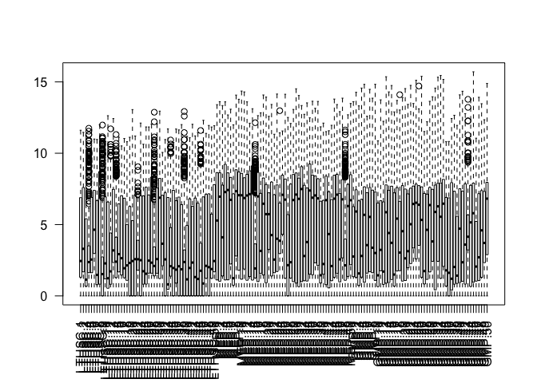
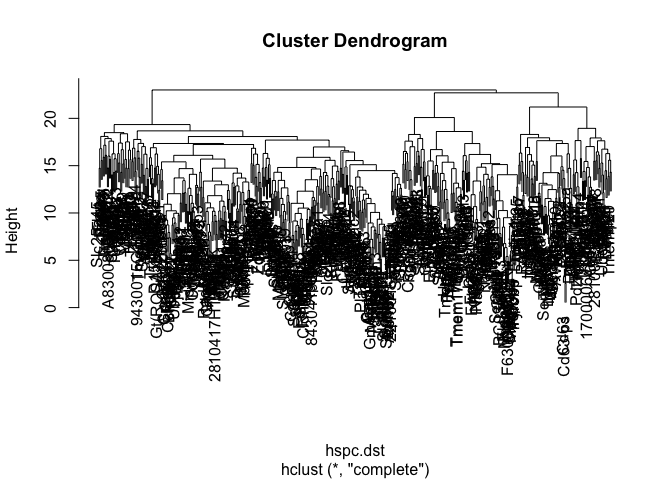

Foundations of R programming I
================
Shamit Soneji
12/10/2018

Why use R?
----------

R is a programming environment with a focus on mathematics and statistics, but can be used for a variety of applications given the flexibility of the language. R is also free and available for all operating systems. Given the richness of the language and no cost to use it, bioinformaticians have adopted R as the platform for which which to develop packages to solve bioinformatics problems.

Getting R
---------

Point your browser to <http://cran.r-project.org/> to download and install the latest version of R. For these tutorials we are also going o use [RStudio](http://www.rstudio.com/) which is an advanced environment for R which includes a window for an editor, console, and plotting window. You will see what this means later.

With respect to bioinformatics, the central repository for bioinformatics tools is [Bioconductor](http://www.bioconductor.org) where packages are deposited for easy installation.

Before we go on to these, we need to get to grips with the basics of the R language first.

R- The basics
-------------

### 1- Vectors

The R language is relatively intuative. For example, making a string of numbers from 1 to 10:

``` r
x <- c(1,2,3,4,5,6,7,8,9,10)
```

The "c" in the code above means "combine", therefore all the comma separated numbers between the parentheses are put together to create a `vector`.

To view the contents of the object you have just created, just type "x" and hit return:

``` r
x
```

    ##  [1]  1  2  3  4  5  6  7  8  9 10

There is a much simpler way to create the same type of object:

``` r
x <- 1:10
x
```

    ##  [1]  1  2  3  4  5  6  7  8  9 10

Much better. Using a comma will always do increments of 1, but is also bidirectional:

``` r
y <- 5:-5
y
```

    ##  [1]  5  4  3  2  1  0 -1 -2 -3 -4 -5

Another way of ceating a sequence of numbers is to use the `seq` function. To learn how this function works, issue the command `help(seq)`. In R you can get a manual for any function using the `help()` command. To generate a vector of numbers from 1 to 100 in steps of 10 we need:

``` r
a <- seq(0,100,by=10)
a
```

    ##  [1]   0  10  20  30  40  50  60  70  80  90 100

***Exercise:*** Generate a vector called 'b' ranging from 3 to 987 where the length of the vector is 53 entries long. Done? Check the length of the vector you have just made by issuing `length(b)`.

Now that we can make vectors we can start playing with them. for example:

``` r
c <- 1:50
d <- 1/c
```

Lets plot the numbers contained in the object we called `d`:

``` r
plot(d)
```

 Note the way the axes are labelled in the plot function.

***Exercise:*** Call `help(plot)` and read about the other options available. Produce the same plot as above, but this time as a line plot which is coloured red. Also, label the axes and give the plot a title.

We can also do basic calculations on vectors:

``` r
mean(d) # calculate the mean of the vector
```

    ## [1] 0.08998411

``` r
sd(d) # the standard deviation
```

    ## [1] 0.1578087

### 2- Matricies

Matricies are the most common data format bioinformaticians work with (microarray data for example). Lets make one:

``` r
m <- matrix(0,ncol=5,nrow=10)
m
```

    ##       [,1] [,2] [,3] [,4] [,5]
    ##  [1,]    0    0    0    0    0
    ##  [2,]    0    0    0    0    0
    ##  [3,]    0    0    0    0    0
    ##  [4,]    0    0    0    0    0
    ##  [5,]    0    0    0    0    0
    ##  [6,]    0    0    0    0    0
    ##  [7,]    0    0    0    0    0
    ##  [8,]    0    0    0    0    0
    ##  [9,]    0    0    0    0    0
    ## [10,]    0    0    0    0    0

This will create a matrix filled with zeros. To transpose the matrix we use `t()` (this will be important later)

``` r
tposed.m <- t(m)
tposed.m
```

    ##      [,1] [,2] [,3] [,4] [,5] [,6] [,7] [,8] [,9] [,10]
    ## [1,]    0    0    0    0    0    0    0    0    0     0
    ## [2,]    0    0    0    0    0    0    0    0    0     0
    ## [3,]    0    0    0    0    0    0    0    0    0     0
    ## [4,]    0    0    0    0    0    0    0    0    0     0
    ## [5,]    0    0    0    0    0    0    0    0    0     0

Lets make a matrix (and a vector) containing numbers so we can look at subsetting:

``` r
v <- 1:10
m <- t(matrix(1:50,ncol=10,nrow=5))
m
```

    ##       [,1] [,2] [,3] [,4] [,5]
    ##  [1,]    1    2    3    4    5
    ##  [2,]    6    7    8    9   10
    ##  [3,]   11   12   13   14   15
    ##  [4,]   16   17   18   19   20
    ##  [5,]   21   22   23   24   25
    ##  [6,]   26   27   28   29   30
    ##  [7,]   31   32   33   34   35
    ##  [8,]   36   37   38   39   40
    ##  [9,]   41   42   43   44   45
    ## [10,]   46   47   48   49   50

We can access individual elements using square brackets `[]`. Here are some examples:

``` r
v[c(7,1,5)] #access elements 7 1 and 5 of the vector
```

    ## [1] 7 1 5

``` r
m[1,] # access the first row of the matrix
```

    ## [1] 1 2 3 4 5

``` r
m[,3] # the 3rd column
```

    ##  [1]  3  8 13 18 23 28 33 38 43 48

``` r
m[8,2] # the value in the 8th row and 2nd column
```

    ## [1] 37

``` r
m[3:7,4] # the 3rd to 7th row of the 4th columnß
```

    ## [1] 14 19 24 29 34

We often have the need to collect vectors and assemble them into matricies. This can be done using the `rbind` (row) and `cbind` (column) function:

``` r
v1 <- 1:10
v2 <- 101:110
rbound.mat <-rbind(v1,v2)
cbound.mat <- cbind(v1,v2)
rbound.mat
```

    ##    [,1] [,2] [,3] [,4] [,5] [,6] [,7] [,8] [,9] [,10]
    ## v1    1    2    3    4    5    6    7    8    9    10
    ## v2  101  102  103  104  105  106  107  108  109   110

``` r
cbound.mat
```

    ##       v1  v2
    ##  [1,]  1 101
    ##  [2,]  2 102
    ##  [3,]  3 103
    ##  [4,]  4 104
    ##  [5,]  5 105
    ##  [6,]  6 106
    ##  [7,]  7 107
    ##  [8,]  8 108
    ##  [9,]  9 109
    ## [10,] 10 110

### 3- Lists

Lists are a class of container which allow multiple objects to be stored in a single variable. For example:

``` r
alpha <- LETTERS[1:8]
mat <- matrix(rnorm(40),nrow=8)
listex1  <- list(char=alpha,nums=mat)
```

Each element can now be accessed via `$`:

``` r
listex1$char
```

    ## [1] "A" "B" "C" "D" "E" "F" "G" "H"

``` r
listex1$nums
```

    ##            [,1]       [,2]       [,3]       [,4]       [,5]
    ## [1,]  0.5411378 -1.1078301  0.0615231 -0.7042265  0.1879346
    ## [2,] -0.1067889 -0.8186695  0.5383642  1.2322466  1.4222991
    ## [3,]  1.6617953 -0.1261685 -1.6464186 -2.4489938 -0.1226037
    ## [4,]  0.4800044 -0.5870114 -0.0605121 -0.1361855 -0.1558800
    ## [5,]  1.3106675 -0.1581960 -2.4975543 -1.3245611  1.1154836
    ## [6,]  1.0167293  0.2497965  0.1877007 -1.1912111 -1.3895658
    ## [7,] -2.1398875 -0.6539722 -0.6589315  0.4760210  0.5816673
    ## [8,] -0.4349157  1.0967823 -0.2920229 -0.8925902 -1.1832576

``` r
listex1$nums[1,] # the matrix within the list issubsetted as before
```

    ## [1]  0.5411378 -1.1078301  0.0615231 -0.7042265  0.1879346

Another way of doing the above is:

``` r
listex1[[1]] # note the double square brackets
```

    ## [1] "A" "B" "C" "D" "E" "F" "G" "H"

``` r
listex1[[2]]
```

    ##            [,1]       [,2]       [,3]       [,4]       [,5]
    ## [1,]  0.5411378 -1.1078301  0.0615231 -0.7042265  0.1879346
    ## [2,] -0.1067889 -0.8186695  0.5383642  1.2322466  1.4222991
    ## [3,]  1.6617953 -0.1261685 -1.6464186 -2.4489938 -0.1226037
    ## [4,]  0.4800044 -0.5870114 -0.0605121 -0.1361855 -0.1558800
    ## [5,]  1.3106675 -0.1581960 -2.4975543 -1.3245611  1.1154836
    ## [6,]  1.0167293  0.2497965  0.1877007 -1.1912111 -1.3895658
    ## [7,] -2.1398875 -0.6539722 -0.6589315  0.4760210  0.5816673
    ## [8,] -0.4349157  1.0967823 -0.2920229 -0.8925902 -1.1832576

``` r
listex1[[2]][1,]
```

    ## [1]  0.5411378 -1.1078301  0.0615231 -0.7042265  0.1879346

4- Reading and writing files
============================

To analyse data in R, you have to get the data into R first (this helps a lot). R has some useful functions to do this, so now we can take our first look at some microarray data. Download this file (<http://bone.bmc.lu.se/Public/Mouse_HSPC_reduced.txt>) and save it to your current working directory.

***Exercise:*** Open the file to see how it looks, and then call `help(read.delim)` and try to work out how the file you are looking at could be read into R.

This is how I would do it:

``` r
hspc.data <- read.delim("Mouse_HSPC_reduced.txt",header=T,row.name=1,sep="\t")
colnames(hspc.data) # view the column names
```

    ##   [1] "LTHSC.1"  "LTHSC.2"  "LTHSC.3"  "LTHSC.4"  "LTHSC.5"  "LTHSC.6" 
    ##   [7] "LTHSC.7"  "LTHSC.8"  "LTHSC.9"  "LTHSC.10" "LTHSC.11" "LTHSC.12"
    ##  [13] "LTHSC.13" "LTHSC.14" "LTHSC.15" "LTHSC.16" "LTHSC.17" "LTHSC.18"
    ##  [19] "LTHSC.19" "LTHSC.20" "LTHSC.21" "LTHSC.22" "LTHSC.23" "LTHSC.24"
    ##  [25] "LTHSC.25" "LTHSC.26" "LTHSC.27" "LTHSC.28" "LTHSC.29" "LTHSC.30"
    ##  [31] "LTHSC.31" "LTHSC.32" "LTHSC.33" "LTHSC.34" "LTHSC.35" "LTHSC.36"
    ##  [37] "LTHSC.37" "LTHSC.38" "LTHSC.39" "LTHSC.40" "LTHSC.41" "LTHSC.42"
    ##  [43] "LTHSC.43" "LTHSC.44" "LTHSC.45" "LTHSC.46" "LTHSC.47" "LTHSC.48"
    ##  [49] "LTHSC.49" "LTHSC.50" "MEP.1"    "MEP.2"    "MEP.3"    "MEP.4"   
    ##  [55] "MEP.5"    "MEP.6"    "MEP.7"    "MEP.8"    "MEP.9"    "MEP.10"  
    ##  [61] "MEP.11"   "MEP.12"   "MEP.13"   "MEP.14"   "MEP.15"   "MEP.16"  
    ##  [67] "MEP.17"   "MEP.18"   "MEP.19"   "MEP.20"   "MEP.21"   "MEP.22"  
    ##  [73] "MEP.23"   "MEP.24"   "MEP.25"   "MEP.26"   "MEP.27"   "MEP.28"  
    ##  [79] "MEP.29"   "MEP.30"   "MEP.31"   "MEP.32"   "MEP.33"   "MEP.34"  
    ##  [85] "MEP.35"   "MEP.36"   "MEP.37"   "MEP.38"   "MEP.39"   "MEP.40"  
    ##  [91] "MEP.41"   "MEP.42"   "MEP.43"   "MEP.44"   "MEP.45"   "MEP.46"  
    ##  [97] "MEP.47"   "MEP.48"   "MEP.49"   "MEP.50"   "GMP.1"    "GMP.2"   
    ## [103] "GMP.3"    "GMP.4"    "GMP.5"    "GMP.6"    "GMP.7"    "GMP.8"   
    ## [109] "GMP.9"    "GMP.10"   "GMP.11"   "GMP.12"   "GMP.13"   "GMP.14"  
    ## [115] "GMP.15"   "GMP.16"   "GMP.17"   "GMP.18"   "GMP.19"   "GMP.20"  
    ## [121] "GMP.21"   "GMP.22"   "GMP.23"   "GMP.24"   "GMP.25"   "GMP.26"  
    ## [127] "GMP.27"   "GMP.28"   "GMP.29"   "GMP.30"   "GMP.31"   "GMP.32"  
    ## [133] "GMP.33"   "GMP.34"   "GMP.35"   "GMP.36"   "GMP.37"   "GMP.38"  
    ## [139] "GMP.39"   "GMP.40"   "GMP.41"   "GMP.42"   "GMP.43"   "GMP.44"  
    ## [145] "GMP.45"   "GMP.46"   "GMP.47"   "GMP.48"   "GMP.49"   "GMP.50"

``` r
nrow(hspc.data) # the number of rows in the dataset
```

    ## [1] 4170

``` r
ncol(hspc.data) # number of columns
```

    ## [1] 150

``` r
dim(hspc.data) # number of rows and columns together
```

    ## [1] 4170  150

``` r
colnames(hspc.data) #output the columns headers
```

    ##   [1] "LTHSC.1"  "LTHSC.2"  "LTHSC.3"  "LTHSC.4"  "LTHSC.5"  "LTHSC.6" 
    ##   [7] "LTHSC.7"  "LTHSC.8"  "LTHSC.9"  "LTHSC.10" "LTHSC.11" "LTHSC.12"
    ##  [13] "LTHSC.13" "LTHSC.14" "LTHSC.15" "LTHSC.16" "LTHSC.17" "LTHSC.18"
    ##  [19] "LTHSC.19" "LTHSC.20" "LTHSC.21" "LTHSC.22" "LTHSC.23" "LTHSC.24"
    ##  [25] "LTHSC.25" "LTHSC.26" "LTHSC.27" "LTHSC.28" "LTHSC.29" "LTHSC.30"
    ##  [31] "LTHSC.31" "LTHSC.32" "LTHSC.33" "LTHSC.34" "LTHSC.35" "LTHSC.36"
    ##  [37] "LTHSC.37" "LTHSC.38" "LTHSC.39" "LTHSC.40" "LTHSC.41" "LTHSC.42"
    ##  [43] "LTHSC.43" "LTHSC.44" "LTHSC.45" "LTHSC.46" "LTHSC.47" "LTHSC.48"
    ##  [49] "LTHSC.49" "LTHSC.50" "MEP.1"    "MEP.2"    "MEP.3"    "MEP.4"   
    ##  [55] "MEP.5"    "MEP.6"    "MEP.7"    "MEP.8"    "MEP.9"    "MEP.10"  
    ##  [61] "MEP.11"   "MEP.12"   "MEP.13"   "MEP.14"   "MEP.15"   "MEP.16"  
    ##  [67] "MEP.17"   "MEP.18"   "MEP.19"   "MEP.20"   "MEP.21"   "MEP.22"  
    ##  [73] "MEP.23"   "MEP.24"   "MEP.25"   "MEP.26"   "MEP.27"   "MEP.28"  
    ##  [79] "MEP.29"   "MEP.30"   "MEP.31"   "MEP.32"   "MEP.33"   "MEP.34"  
    ##  [85] "MEP.35"   "MEP.36"   "MEP.37"   "MEP.38"   "MEP.39"   "MEP.40"  
    ##  [91] "MEP.41"   "MEP.42"   "MEP.43"   "MEP.44"   "MEP.45"   "MEP.46"  
    ##  [97] "MEP.47"   "MEP.48"   "MEP.49"   "MEP.50"   "GMP.1"    "GMP.2"   
    ## [103] "GMP.3"    "GMP.4"    "GMP.5"    "GMP.6"    "GMP.7"    "GMP.8"   
    ## [109] "GMP.9"    "GMP.10"   "GMP.11"   "GMP.12"   "GMP.13"   "GMP.14"  
    ## [115] "GMP.15"   "GMP.16"   "GMP.17"   "GMP.18"   "GMP.19"   "GMP.20"  
    ## [121] "GMP.21"   "GMP.22"   "GMP.23"   "GMP.24"   "GMP.25"   "GMP.26"  
    ## [127] "GMP.27"   "GMP.28"   "GMP.29"   "GMP.30"   "GMP.31"   "GMP.32"  
    ## [133] "GMP.33"   "GMP.34"   "GMP.35"   "GMP.36"   "GMP.37"   "GMP.38"  
    ## [139] "GMP.39"   "GMP.40"   "GMP.41"   "GMP.42"   "GMP.43"   "GMP.44"  
    ## [145] "GMP.45"   "GMP.46"   "GMP.47"   "GMP.48"   "GMP.49"   "GMP.50"

***Exercise:*** Using subsetting we learnt about earlier, split this data matrix into three parts called `lthsc`, `mep` and `gmp` to separate the cell types shown in the headings. For this look at the help page for a function called `grep`.

``` r
lthsc <- hspc.data[,grep("LTHSC",colnames(hspc.data))]
mep <- hspc.data[,grep("MEP",colnames(hspc.data))]
gmp <- hspc.data[,grep("GMP",colnames(hspc.data))]
```

To write a table use the `write.table` function:

``` r
write.table(lthsc,"LTHSC_data.txt",row.names=T,col.names=NA,sep="\t",quote=F)
```

***Exercise:*** Write out the data for the MEP and GMP data into two files.

The data tables we have now are in the form of a data.frame. Try:

``` r
class(mep)
```

    ## [1] "data.frame"

This can be an awkward format for some operations so we can conver it to a simple matrix first:

``` r
hspc.data <- as.matrix(hspc.data)
lthsc <- as.matrix(lthsc)
mep <- as.matrix(mep)
gmp <- as.matrix(mep)
```

Try this now:

``` r
class(mep)
```

    ## [1] "matrix"

### 5- Flow control and Functions

This is where it starts to get more interesting. Now we have these two datasets loaded in memory, we can use them to learn about flow control and some basic mathematical functions. We are going to do a few things the "long way" so you get the idea of how flow control works, and then we'll look at some shortcuts.

Flow control is how multi-step processes are carried out. In the example below we print out the numbers 1 to 10:

``` r
for(i in 1:10){
  print(i)
}
```

    ## [1] 1
    ## [1] 2
    ## [1] 3
    ## [1] 4
    ## [1] 5
    ## [1] 6
    ## [1] 7
    ## [1] 8
    ## [1] 9
    ## [1] 10

To translate this code, it simply says for every integer from 1 to 10, print this value to the screen.

***Exercises:*** - Using the example above, print the first 10 lines of `lthcs` in a `for` loop. - Print every 2nd line of `mep` from lines 1 to 50.

An important point regarding `for` loops is that any processes/calculations occurring within the loop will stay in the loop. If data generated within a loop has to be retained, we need to create a container to "fill up" while the loop is being carried out.

``` r
vec <- NULL
for(i in 1:10){
  vec <- c(vec,i*10)
}
```

The container `vec` is initialised outside the loop, and then populated by concatenating on to it after every iteration of the loop.

***Exercise:*** Initialise an empty container, and for `gmp`, calculate the mean of each row (gene), and store the results in the containers you made.

``` r
gmp.row.mean <- NULL

for(i in 1:nrow(gmp)){
  gmp.row.mean <- c(gmp.row.mean,mean(gmp[i,]))
}
```

We will now take a look at *functions*. As an example, lets turn the code you wrote in the exercise above into a function where we also calculate the variance for a gene too.

``` r
calc.mean.and.sd <- function(mat){
  
  mn <- NULL
  vr <- NULL
  
  for(i in 1:nrow(mat)){  
      mn <- c(mn,mean(mat[i,]))
      vr <- c(vr,var(mat[i,]))
    
  }
  res <- list(mns=mn,vars=vr)
  res # the last line in a function is what the function will return
}
```

By putting this code into a function we can now calculate the means and deviations of any matrix. For example, `gmp`:

``` r
gmp.mn.sd <- calc.mean.and.sd(gmp) 
```

Functions can also work with built in conditions:

``` r
animal.maths <- function(value1,value2,animal=c("pig","cow")){
  
  if(animal=="pig"){print(value1/value2)}
  if(animal=="cow"){print(value1*value2)}
  
}
animal.maths(5,5,"pig")
```

    ## [1] 1

``` r
animal.maths(5,5,"cow")
```

    ## [1] 25

These functions can now be "banked" for use whenever they are needed (probably not `animal.maths` to be fair). However, you should avoid using for-loops etc altogether since R has some built in functions that are much quicker and tidier. Lets look at that now.

### 6- Apply

'apply' is a commonly used function in R to speed up matrix calculation. For example, to calculates means of a matrix we can do this:

``` r
lthsc.row.mn <- apply(lthsc,1,mean) # means of rows
lthsc.col.mn <- apply(lthsc,2,mean) # means of columns
```

The format for the function is therefore the matrix first, the direction in which you would like to apply the function in the 3rd argument.

use `apply` to calculate row and column totals and deviations for a yeast dataset of your choosing.

Your own functions can also be used with `apply` when used as the 3rd argument. Example:

``` r
example.func <- function(v){
  
  val <- (mean(v)*sd(v))/sum(v) ## This is a nonsense operation.
  val
}

ex.apply <- apply(mep,1,example.func)
```

Lets use the apply function to get the top 500 most variable genes in our HSPC dataset:

``` r
gene.vars <- apply(hspc.data,1,var)
top.var.genes <- names(rev(sort(gene.vars))[1:500])
hspc.var <- hspc.data[top.var.genes,]
```

### 7- Standardising data

Lets take a look at the range of the data, i.e getting the lowest and higest value in the matrix of variable genes we just made.

``` r
range(hspc.var)
```

    ## [1]  0.0000 15.7097

For some operations (such as making heatmaps) the data needs to be z-score normalised (scaled) first. When we scale data, each row of gene is standarised so that it's mean=0 and sd=1. Specifically for a gene `g` of the i-th row:

$$Z\_i= \\frac{g\_i-\\hat{g}}{\\sigma\_g}$$

which means for each row we subtract the mean of the row, and then divide by the sd of the row.

***Exercise:*** write a function called `zscore` which will take a single vector of values and scale them. When you have done this, `apply` this to the `hspc.var` matrix to scale all rows and call it `hspc.zs`.

Now take a look at the first row of the normalised data. Call `nrow` on the matrix. Does it look right?

``` r
hspc.zs <- t(apply(hspc.var,1,zscore))
boxplot(hspc.zs,las=2)
```


``` r
# compare to the original data
boxplot(hspc.var,las=2)
```



We can see now the data has been centralised around 0.

8- Clustering
=============

Clustering is one of the most common visualisation techniques for genes expression data. Here we will learn how to do some basic histograms/heatmaps and plotting. The first thing
R has many ways to do this, and many packages have been written specifically for expression data. We are not going to use these for now, but concentrate on the basic underlying functions that do the maths. For example, the `gplots` package uses the `hclust` function which is provided by R. So we will use `hclust` for now.

To use `hclust` we need to provide a distance matrix. This is done using the `dist` function:

``` r
hspc.dst <- dist(hspc.zs)
```

The we cluster using `hclust`:

``` r
hspc.hc <- hclust(hspc.dst)
```

Plot the dendrogram:

``` r
plot(hspc.hc)
```



You'll see form this what we have clustered are the genes. If you want to cluster the cells then you need to transpose the matrix using `t()`:

``` r
hspc.dst <- dist(t(hspc.zs)) #transpose the matrix here!
hspc.hc <- hclust(hspc.dst)
plot(hspc.hc)
```


We can see this is pretty much useless. It is far to compact and doesn't really tell us anything. What we would like is to make a heatmap where the genes and samples are clusters, and to do this we need to retrieve some information created by `hclust`

Call `names` to see which information is available in the newly created object:

``` r
names(hspc.hc)
```

    ## [1] "merge"       "height"      "order"       "labels"      "method"     
    ## [6] "call"        "dist.method"

What we need here is the component called `order`. We can get this using the `$` assignment.

``` r
hspc.hc$order
```

    ##   [1]  51   8  80  95  54  85  91  59  76  87  97  52  66  62  63  82  55
    ##  [18]  64  61  75 100  58  60  94  79  30  70  56  86  84  92 106  78  71
    ##  [35]  73  74  81  99  68  88  53  69 131 129 107 102 132 145 113 126 109
    ##  [52] 115 133 105 117 116 141 147 120 104 118 111 101 143 108 114   2 128
    ##  [69] 148 140 149 134 123 122 150 124 125 119 144 103 112 138 121 130 137
    ##  [86] 135 139 146  25  27  21   6  31  16  13  15  26  50   7  38 136  33
    ## [103]  46  11  37  20  23  34  17  14  12  18   1  49  10  29  43  32  35
    ## [120]   3   9  28  39  40  42  47  44  36  45  41  19  48   5  24 142 110
    ## [137]   4  98  22  65 127  90  67  72  83  77  57  89  93  96

This is the order the cells appear in form left to right when you plotted the dendrogram os cells ust before. We use this to reorder the z-scored matrix:

``` r
hspc.cell.clustered <- hspc.zs[,hspc.hc$order]
```

To make a heatmap of the data call `image`:

``` r
image(hspc.cell.clustered)
```

 Ok, this doesn't look like it should! The matrix is the wrong way round, the colours aren't right, and there are no labels. The downside to R is that getting all this done takes time and knowledge of R's plotting capabilities. Thankfully people have already done this and put the code into functions/packages for people to download and use.

***Exercise:*** Install the `pheatmap` package.

To use the functions provided by gplots we have to load it first:

``` r
library(pheatmap)
```

We can now use the `pheatmap` function that the package provides:

``` r
pheatmap(hspc.zs)
```


The pheatmap function uses `hclust` to cluster the genes and cells and reorders the matrix according to both. Lets output this to a file:

``` r
png("HSPC_heatmap.png",height=4500,width=1500)
pheatmap(hspc.zs)
dev.off()
```

    ## quartz_off_screen 
    ##                 2

The file is opened, and the plot is then made. The `dev.off()` then closed and finalises the file, i.e nothing more can be written to it.

***Exercise:*** call `help (pheatmap)` and see what options are available. Play with the options to see what they do.

Clustering is pretty pointless if you can't define groups and get to the gene names. First we need to capture the output from `pheatmap` as a variable:

``` r
hspc.clust <- pheatmap(hspc.zs)
```

 Lets take a look at the contents of `hspc.clust`:

``` r
names(hspc.clust)
```

    ## [1] "tree_row" "tree_col" "kmeans"   "gtable"

What we want is the information contained within the hclust object in `tree_row`. We get this by treating it like a list:

``` r
hspc.clust$tree_row
```

    ## 
    ## Call:
    ## hclust(d = d, method = method)
    ## 
    ## Cluster method   : complete 
    ## Distance         : euclidean 
    ## Number of objects: 500

``` r
hspc.clust$tree_row$order #the order of genes in the heatmap for examples.
```

    ##   [1] 164 413 306 314 293 490 387 491 425 476 276 489 434 458 309 360 315
    ##  [18] 467 324 184 340 372 405 385 469 205 127 354 246 429 249 465 423 485
    ##  [35] 454 192 368 399 418 400 492 254 449 464 494 123 496 199 313 461 327
    ##  [52] 272 193 495 367 395 379 497 126 478 353 150 347 444  37  43  63  76
    ##  [69]  39  56  83 248 380 237 312  65 204  73 394 303 439 374 381 377 180
    ##  [86] 200 220 427 136 455 487 189 233 432 185 145 167 463 302 247 451 252
    ## [103] 337  97 228 155 144 258  28 107 152 383 195 142 138 271 161 325 176
    ## [120] 277 113 472 398 173 243 244 373 250 296 417 488 190 384 234 364 131
    ## [137] 460  80 154 263 351 175 159 259 334 281 236 441 361 414 401 477 500
    ## [154] 121 280 285 257 422 471 301 198 338 279 284 346 445 238 355 483 270
    ## [171] 298 402 158 262 151 240 171 209 420  98 299  57  67 331 147  53  69
    ## [188] 124 330 288 349  61 102 129 265 305 153  29 187 106  72  99  78  40
    ## [205] 108  55 197 235 256 357  49  66 307 160 484 468  88 437 282 297 169
    ## [222] 239 320 275 177 479 386 216 392 225 462 378 415 179 345 352 470  85
    ## [239] 409 304 486 370 457 212  62  90 231 323  70 203 318  82 382 410  52
    ## [256] 130 111 115 213 294 122 103  41  19   4  13  14  27  58  10 174  94
    ## [273]  46  35   8  24  33 165 132  51  30  31 128  12  34 105 322 369 214
    ## [290] 393 141  75 223 343 101 391  81 362 140 438 117 396 201 137 311  79
    ## [307] 435 245 266 283 433 316 371 450 388 499 224  32 229 269  92 221 366
    ## [324] 100 498 211 426 133 226 242  77 333 143 162 166 264 125 317 109 230
    ## [341] 448  16  59 157 342  84 206 480 222  64 114 290 219 411 475 170 363
    ## [358] 407 202 278 253 421 207 344 348  38 186  86  11   9  18 146 319 328
    ## [375] 459 112 452 210  96 329 188 341 365  68 178 474  48 291 183  45 119
    ## [392]  54 134  74   7 215   1   5  36 104  20  15   2   3  21  17  23 135
    ## [409] 218 332 408 289 292 268 404 326 390 191 308  44 358 419 406 456 403
    ## [426] 440 397 466 217 267 300  93 181  91 116  22  50 412 163  26   6 156
    ## [443]  71 232 251 182 442 194  87 208 227 339 149 473 273 389 376 120  42
    ## [460]  60  25  89 424 443 321 172 428  47  95 196 446 335 482 295 493 350
    ## [477] 118 430 241 168 139 148 375 431 356 447 453 260 286 481 110 255 287
    ## [494] 261 416 436 310 336 274 359

Lets say that we want to split the genes in to 5 clusters groups, we can call the `cutree` function on an `hclust` object to do this:

``` r
gene.clusters <- cutree(hspc.clust$tree_row,k=5)
gene.clusters[1:20] # shows the results for the first 20 genes.
```

    ##         Elane          Ctsg           Mpo          Car1         Ms4a3 
    ##             1             1             1             2             1 
    ##           Mpl         Ly6c2          Klf1          Nkg7         Ces2g 
    ##             3             1             2             1             2 
    ##          Cst7         Ermap          Aqp1       Gm15915       Clec12a 
    ##             1             2             2             2             1 
    ##         Prtn3         Rab44         Plac8         Gata1 F630028O10Rik 
    ##             1             1             1             2             1

``` r
table(gene.clusters)
```

    ## gene.clusters
    ##   1   2   3   4   5 
    ##  90 296  53  23  38

``` r
barplot(table(gene.clusters))
```


Lets isolate all the genes beloning to cluster 1 using the `which` command:

``` r
which(gene.clusters==1)
```

    ##         Elane          Ctsg           Mpo         Ms4a3         Ly6c2 
    ##             1             2             3             5             7 
    ##          Nkg7          Cst7       Clec12a         Prtn3         Rab44 
    ##             9            11            15            16            17 
    ##         Plac8 F630028O10Rik        Atp8b4        Tyrobp         Anxa3 
    ##            18            20            21            23            36 
    ##         Fcgr3          Ccl9         Alas1          Sell           Emb 
    ##            38            45            48            54            59 
    ##          Lyz2           Fes           Hk3      Serpinf1      Tbc1d10c 
    ##            64            68            74            77            84 
    ##        Adgrg3         Gstm1         Napsa           Wls         Igsf6 
    ##            86            92            96           100           104 
    ##       Unc93b1        Fcer1g      Tmem176a          Cd53          Cd93 
    ##           109           112           114           119           125 
    ##       Tsc22d3      BC035044       Emilin1         Anxa1         Spns3 
    ##           133           134           135           143           146 
    ##        Gm8995        Sptbn1         Rab32          Gmpr         Myo1g 
    ##           157           162           166           170           178 
    ##     Serpinb1a           Hdc         Casp1         Klhl6         Anxa5 
    ##           183           186           188           202           206 
    ##        Lgals1        Adssl1         Asah1            Hp        Tcirg1 
    ##           207           210           211           215           218 
    ##        Ifi203          Cnn2        Fkbp1a         Cers5       Tmem173 
    ##           219           221           222           226           230 
    ##          Ctsc      Mapkapk3          Tcn2         Stap1         Tor3a 
    ##           242           253           264           269           278 
    ##      Tmem176b        Ms4a6c          Tfec           Vim        Igfbp4 
    ##           290           291           317           319           328 
    ##           Lbp          Ppic          Hexa          Irf1        Csf2rb 
    ##           329           333           341           342           344 
    ##        Fcgr2b          Cpa3         Anxa2         Plcb2        Rasal3 
    ##           348           363           365           366           407 
    ##        Gpr171          Idh1          Pak1          Lcp1         Parp8 
    ##           411           421           426           448           452 
    ##       Pstpip1          Rgs2       Fam189b        Adgrl4         Elmo1 
    ##           459           474           475           480           498

We can isolate these rows only from our `hspc.zs` matrix as we did before:

``` r
hspc.cluster.1 <- hspc.zs[names(which(gene.clusters==1)),]
```

We can now see how these gene behave as a whole using a boxplot:

``` r
boxplot(hspc.cluster.1,las=2)
```


